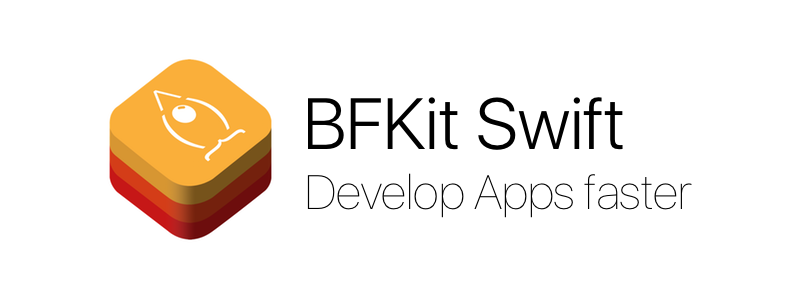

<p align="center">

</p>

[](https://travis-ci.org/FabrizioBrancati/BFKit-Swift)
[](https://coveralls.io/github/FabrizioBrancati/BFKit-Swift?branch=master)
[](https://codebeat.co/projects/github-com-fabriziobrancati-bfkit-swift-master)
[](https://github.com/apple/swift-package-manager)
[](https://github.com/Carthage/Carthage)
[][Documentation]
[](https://github.com/FabrizioBrancati/BFKit-Swift/blob/master/LICENSE)
<br>
[](https://swift.org/)
[][Documentation]

---

<p align="center">
    <a href="#features">Features</a> &bull;
    <a href="#classes-and-extensions-compatibility">Classes and Extensions Compatibility</a> &bull;
    <a href="#requirements">Requirements</a> &bull;
    <a href="#communication">Communication</a> &bull;
    <a href="#contributing">Contributing</a> &bull;
    <a href="#installing-and-usage">Installing and Usage</a> &bull;
    <a href="#documentation">Documentation</a> &bull;
    <a href="#changelog">Changelog</a> &bull;
    <a href="#example">Example</a> &bull;
    <a href="#todo">Todo</a> &bull;
    <a href="#author">Author</a> &bull;
    <a href="#license">License</a>
</p>

---

Features
========

BFKit-Swift is a collection of useful classes, structs and extensions to **develop Apps faster**.<br>
For example you can use every **iOS font with just an enum!**<br>
It also adds some useful functions with **Custom** classes and extends **Foundation**, **UIKit**, **AppKit** and **WatchKit** classes.

Classes and Extensions Compatibility
====================================

### BFKit
|                 | **iOS** | **macOS** | **watchOS** | **Linux** |
|-----------------|---------|-----------|-------------|-----------|
| [BFApp](https://github.fabriziobrancati.com/documentation/BFKit-Swift/Structs/BFApp.html) | ![✓] | ![✓] | ![✓] | ![✓] |
| [BFBiometric](https://github.fabriziobrancati.com/documentation/BFKit-Swift/Structs/BFBiometric.html) | ![✓] | | | |
| [BFButton](https://github.fabriziobrancati.com/documentation/BFKit-Swift/Classes/BFButton.html) | ![✓] | | | |
| BFDataStructures<br>([List](https://github.fabriziobrancati.com/documentation/BFKit-Swift/Structs/List.html) - [Queue](https://github.fabriziobrancati.com/documentation/BFKit-Swift/Structs/Queue.html) - [Stack](https://github.fabriziobrancati.com/documentation/BFKit-Swift/Structs/Stack.html)) | ![✓] | ![✓] | ![✓] | ![✓] |
| [BFLog](https://github.fabriziobrancati.com/documentation/BFKit-Swift/Structs/BFLog.html) | ![✓] | ![✓] | ![✓] | ![✓] |
| [BFPassword](https://github.fabriziobrancati.com/documentation/BFKit-Swift/Structs/BFPassword.html) | ![✓] | ![✓] | ![✓] | ![✓] |
| [BFSystemSound](https://github.fabriziobrancati.com/documentation/BFKit-Swift/Classes/BFSystemSound.html) | ![✓] | | | |
| [BFTextField](https://github.fabriziobrancati.com/documentation/BFKit-Swift/Classes/BFTextField.html) | ![✓] | | | |
| [BFTouchID](https://github.fabriziobrancati.com/documentation/BFKit-Swift/Structs/BFTouchID.html) | ![✓] | | | &nbsp; |

### Foundation
|                 | **iOS** | **macOS** | **watchOS** | **Linux** |
|-----------------|---------|-----------|-------------|-----------|
| [Array](https://github.fabriziobrancati.com/documentation/BFKit-Swift/Extensions/Array.html) | ![✓] | ![✓] | ![✓] | ![✓] |
| [Collection](https://github.fabriziobrancati.com/documentation/BFKit-Swift/Extensions/Collection.html) | ![✓] | ![✓] | ![✓] | ![✓] |
| [Data](https://github.fabriziobrancati.com/documentation/BFKit-Swift/Extensions/Data.html) | ![✓] | ![✓] | ![✓] | ![✓] |
| [Date](https://github.fabriziobrancati.com/documentation/BFKit-Swift/Extensions/Date.html) | ![✓] | ![✓] | ![✓] | ![✓] |
| [FileManager](https://github.fabriziobrancati.com/documentation/BFKit-Swift/Extensions/FileManager.html) | ![✓] | ![✓] | ![✓] | ![✓] |
| [Number](https://github.fabriziobrancati.com/documentation/BFKit-Swift/Functions.html) | ![✓] | ![✓] | ![✓] | ![✓] |
| [NSObject](https://github.fabriziobrancati.com/documentation/BFKit-Swift/Extensions/NSObject.html) | ![✓] | ![✓] | ![✓] | ![✓] |
| [NSAttributedString](https://github.fabriziobrancati.com/documentation/BFKit-Swift/Extensions/NSAttributedString.html) | ![✓] | ![✓] | ![✓] | |
| [NSPointerArray](https://github.fabriziobrancati.com/documentation/BFKit-Swift/Extensions/NSPointerArray.html) | ![✓] | ![✓] | ![✓] | |
| [ProcessInfo](https://github.fabriziobrancati.com/documentation/BFKit-Swift/Extensions/ProcessInfo.html) | ![✓] | ![✓] | ![✓] | ![✓] |
| [Set](https://github.fabriziobrancati.com/documentation/BFKit-Swift/Extensions/Set.html) | ![✓] | ![✓] | ![✓] | ![✓] |
| [String](https://github.fabriziobrancati.com/documentation/BFKit-Swift/Extensions/String.html) | ![✓] | ![✓] | ![✓] | ![✓] |
| [Thread](https://github.fabriziobrancati.com/documentation/BFKit-Swift/Functions.html) | ![✓] | ![✓] | ![✓] | ![✓] |

### Core Graphics
|                 | **iOS** | **macOS** | **watchOS** | **Linux** |
|-----------------|---------|-----------|-------------|-----------|
| CGPoint         | ![✓]    | ![✓]      | ![✓]        | &nbsp;    |

### UIKit / AppKit
|                 | **iOS** | **macOS** | **watchOS** | **Linux** |
|-----------------|---------|-----------|-------------|-----------|
| [UIBarButtonItem](https://github.fabriziobrancati.com/documentation/BFKit-Swift/Extensions/UIBarButtonItem.html) | ![✓] | | | |
| [UIButton](https://github.fabriziobrancati.com/documentation/BFKit-Swift/Extensions/UIButton.html) | ![✓] | | | |
| [UIColor](https://github.fabriziobrancati.com/documentation/BFKit-Swift/Extensions/UIColor.html) | ![✓] | ![✓] | ![✓] | |
| [UIDevice](https://github.fabriziobrancati.com/documentation/BFKit-Swift/Extensions/UIDevice.html) | ![✓] | | | |
| [UIFont](https://github.fabriziobrancati.com/documentation/BFKit-Swift/Extensions/UIFont.html) | ![✓] | | ![✓] | |
| [UIImage](https://github.fabriziobrancati.com/documentation/BFKit-Swift/Extensions/UIImage.html) | ![✓] | | ![✓] | |
| [UIImageView](https://github.fabriziobrancati.com/documentation/BFKit-Swift/Extensions/UIImageView.html) | ![✓] | | | |
| [UILabel](https://github.fabriziobrancati.com/documentation/BFKit-Swift/Extensions/UILabel.html) | ![✓] | | | |
| [UINavigationBar](https://github.fabriziobrancati.com/documentation/BFKit-Swift/Extensions/UINavigationBar.html) | ![✓] | | |           |
| [UIPasteboard](https://github.fabriziobrancati.com/documentation/BFKit-Swift/Extensions/UIPasteboard.html) | ![✓] | | | |
| [UIScreen](https://github.fabriziobrancati.com/documentation/BFKit-Swift/Extensions/UIScreen.html) | ![✓] | | | |
| [UIScrollView](https://github.fabriziobrancati.com/documentation/BFKit-Swift/Extensions/UIScrollView.html) | ![✓] | | | |
| [UITableView](https://github.fabriziobrancati.com/documentation/BFKit-Swift/Extensions/UITableView.html) | ![✓] | | | |
| [UITextField](https://github.fabriziobrancati.com/documentation/BFKit-Swift/Extensions/UITextField.html) | ![✓] | | | |
| [UITextView](https://github.fabriziobrancati.com/documentation/BFKit-Swift/Extensions/UITextView.html) | ![✓] | | | |
| [UIToolbar](https://github.fabriziobrancati.com/documentation/BFKit-Swift/Extensions/UIToolbar.html) | ![✓] | | | |
| [UIView](https://github.fabriziobrancati.com/documentation/BFKit-Swift/Extensions/UIView.html) | ![✓] | | | |
| [UIViewController](https://github.com/FabrizioBrancati/BFKit-Swift/blob/master/Sources/BFKit/iOS/UIKit/UIViewControllerExtension.swift) | ![✓] | | | |
| [UIWindow](https://github.fabriziobrancati.com/documentation/BFKit-Swift/Extensions/UIWindow.html) | ![✓] | | | &nbsp; |

### WebKit
|                 | **iOS** | **macOS** | **watchOS** | **Linux** |
|-----------------|---------|-----------|-------------|-----------|
| [UIWebView](https://github.fabriziobrancati.com/documentation/BFKit-Swift/Extensions/UIWebView.html) | ![✓] | ![✓] | | &nbsp; |

### WatchKit
|                 | **iOS** | **macOS** | **watchOS** | **Linux** |
|-----------------|---------|-----------|-------------|-----------|
| [WKInterfaceController](https://github.fabriziobrancati.com/documentation/BFKit-Swift/Extensions/WKInterfaceController.html) | | | ![✓] | &nbsp; |

Requirements
============

| **Swift** | **Xcode**   | **BFKit-Swift** | **iOS**  | **macOS**  | **watchOS** | **Linux** |
|-----------|-------------|-----------------|----------|------------|-------------|-----------|
| 1.2       | 6.3         | 1.0.0...1.4.1   | 7.0+     |            |             |           |
| 2.0...2.1 | 7.0         | 1.5.0...1.6.2   | 7.0+     |            |             |           |
| 2.2       | 7.3         | 1.6.3...1.7.0   | 7.0+     |            |             |           |
| 2.3       | 8.0         | 1.8.0           | 7.0+     |            |             |           |
| 3.0...3.1 | 8.0...8.3   | 2.0.0...2.3.0   | 8.0+     |            |             | ![✓]      |
| 3.0...3.1 | 8.0...8.3   | 2.4.0...2.5.0   | 8.0+     |            | 2.0+        | ![✓]      |
| 3.0...3.2 | 8.0...9.0   | 2.6.0           | 8.0+     | 10.10+     | 2.0+        | ![✓]      |
| 4.0       | 9.0...9.2   | 3.0.0...3.1.1   | 8.0+ `*` | 10.10+ `*` | 3.0+ `*`    | ![✓]      |
| 4.1       | 9.3...9.4   | 3.1.2...3.2.1   | 8.0+ `*` | 10.10+ `*` | 3.0+ `*`    | ![✓]      |
| 4.2       | 10.0        | 4.0.0...4.1.0   | 8.0+ `*` | 10.10+ `*` | 3.0+ `*`    | ![✓]      |
| 5.0       | 10.2...10.3 | 5.0.0           | 8.0+ `*` | 10.10+ `*` | 3.0+ `*`    | ![✓]      |
| 5.1       | 11          | 6.0.0...6.0.1   | 8.0+ `*` | 10.10+ `*` | 3.0+ `*`    | ![✓]      |

> `*` With App Extension Support

Communication
=============

- If you need help, open an issue
- If you found a bug, open an issue.
- If you have a feature request, open an issue.
- If you want to contribute, see [Contributing](https://github.com/FabrizioBrancati/BFKit-Swift#contributing) section.

Contributing
============

See [CONTRIBUTING.md](https://github.com/FabrizioBrancati/BFKit-Swift/blob/master/.github/CONTRIBUTING.md) file.

Installing and Usage
====================

See [Requirements](https://github.com/FabrizioBrancati/BFKit-Swift#requirements) section to check Swift, Xcode, BFKit-Swift and OS versions.

### Manual
- Open and build the framework from the project (**BFKit.xcodeproj**)
- Import BFKit.framework into your project
- Import the framework with ```import BFKit```
- Enjoy!

### CocoaPods
- Create a **Podfile** in your **project directory** and write into:

    ```ruby
    platform :ios, '8.0'
    xcodeproj 'Project.xcodeproj'
    use_frameworks!

    pod 'BFKit-Swift'
    ```
- Change **"Project"**  with your **real project name**
- Open **Terminal**, go to your **project directory** and type: ```pod install```
- Import the framework with ```import BFKit```
- Enjoy!

### Carthage
- Create a **Cartfile** in your **project directory** and write into:

    ```ruby
    github "FabrizioBrancati/BFKit-Swift"
    ```
- Open **Terminal**, go to **project directory** and type: ```carthage update```
- **Include the created Framework** in your project
- **Add Build Phase** with the following contents:

    ```sh
    /usr/local/bin/carthage copy-frameworks
    ```

    Add the paths to the BFKit-Swift framework under **Input Files**

    ```sh
    $(SRCROOT)/Carthage/Build/iOS/BFKit.framework
    ```

    Add the paths to the copied frameworks to the **Output Files**

    ```sh
    $(BUILT_PRODUCTS_DIR)/$(FRAMEWORKS_FOLDER_PATH)/BFKit.framework
    ```

    This script works around an [App Store submission bug](http://www.openradar.me/radar?id=6409498411401216) triggered by universal binaries and ensures that necessary bitcode-related files are copied when archiving
- **(Optional)** Add Build Phase with the following contents

    ```sh
    /usr/local/bin/carthage outdated --xcode-warnings
    ```

    To automatically warn you when one of your dependencies is out of date
- Import the framework with ```import BFKit```
- Enjoy!

### Swift Package Manager
- Create a **Package.swift** file in your **project directory** and write into:

    ```swift
    // swift-tools-version:5.1
    import PackageDescription

    let package = Package(
        name: "Project",
        products: [
            .executable(name: "Project", targets: ["Project"])
        ],
        dependencies: [
            .package(url: "https://github.com/FabrizioBrancati/BFKit-Swift.git", .upToNextMajor(from: "4.0.0"))
        ],
        targets: [
            .target(name: "Project", dependencies: ["BFKit"])
        ]
    )
    ```
- Change **"Project"**  with your **real project name**
- Open **Terminal**, go to **project directory** and type: ```swift build```
- Import the framework with ```import BFKit```
- Enjoy!

Documentation
=============

### [Documentation]
Jazzy generated documentation - 100% Documented

Changelog
=========

To see what has changed in recent versions of BFKit-Swift, see the **[CHANGELOG.md](https://github.com/FabrizioBrancati/BFKit-Swift/blob/master/CHANGELOG.md)** file.

Example
=======

Open and run the BFKitExample project in Example folder in this repo with Xcode and see BFKit-Swift in action!

Todo
====

- [ ] Add tvOS support
- [ ] Create a new Example App that shows all the functionalities of BFKit-Swift
- [ ] ~100% of code coverage with Unit Tests
- [ ] Improve code to get an _A_ from codebeat
- [x] Add macOS support
- [x] Add watchOS support
- [x] Create Unit Tests and add Codecov badge
- [x] Add Linux support (Foundation extensions only)
- [x] Add Carthage support
- [x] Add to CocoaPods
- [x] Create a great documentation

Author
======

**Fabrizio Brancati**

[Website: https://www.fabriziobrancati.com](https://www.fabriziobrancati.com)
<br>
[Email: fabrizio.brancati@gmail.com](mailto:fabrizio.brancati@gmail.com)

License
=======

BFKit-Swift is available under the MIT license. See the **[LICENSE](https://github.com/FabrizioBrancati/BFKit-Swift/blob/master/LICENSE)** file for more info.

[Documentation]: https://github.fabriziobrancati.com/documentation/BFKit-Swift/
[✓]: Resources/Check.png
